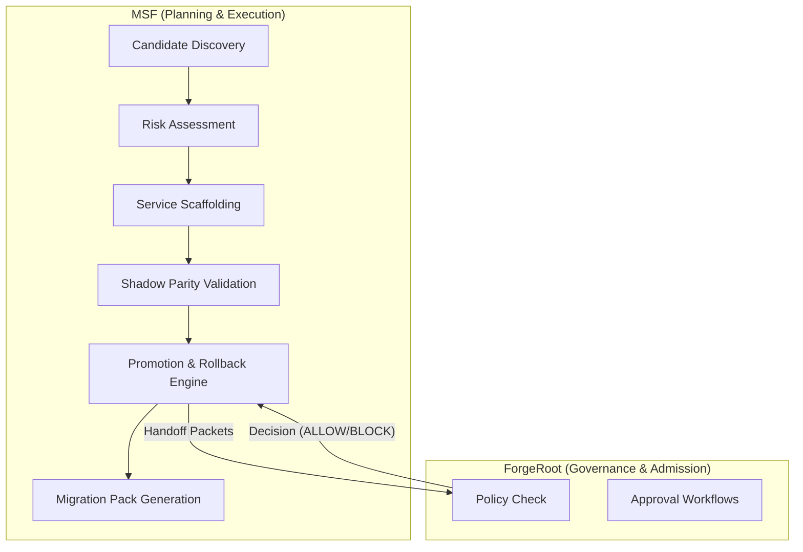

# MSF Operator Runbook

This guide outlines the task-oriented lifecycle for modernizing and extracting legacy services via the MSF framework.

## Architecture & Boundaries


## Lifecycle Execution

### 1. Candidate Discovery
Scan the repository to identify potential extraction candidates.
```bash
python tools/discover_candidates.py --repo-path ./legacy_app
```

### 2. Risk Assessment
Analyze the candidate for sensitive domains to define its protected resource profile.
```bash
python tools/assess_candidate_risk.py --source-dir ./legacy_app/module --contract ./contracts/feature_v1.json --output docs/_generated/feature_protected_resources.json
```

### 3. Service Scaffolding
Generate the cutover manifest, embedding the risk profile.
```bash
python tools/scaffold_cutover.py --feature feature --source-dir ./legacy_app/module --contract ./contracts/feature_v1.json
```

### 4. Shadow Parity Validation
Run dual-read shadowing in production, then evaluate semantic parity.
```bash
python tools/parity_harness.py --log-file shadow/parity.jsonl --output docs/_generated/feature_parity_report.json
```

### 5. ForgeRoot Admission & Promotion
Request ForgeRoot admission and safely promote if `ALLOW` is received.
```bash
python tools/cutover_orchestrator.py promote --manifest docs/_generated/feature_cutover.json --stage canary_10 --execute
```
**Handling ForgeRoot Decisions:**
- **ALLOW**: Low-risk and compliant deployments. MSF automatically executes the deployment and continues to the next stage.
- **REQUIRE_APPROVAL**: High-risk deployments (e.g. involving `payments` or `pii`). MSF halts promotion safely. The operator must obtain out-of-band approval from the designated owners before manually overriding or re-triggering.
- **ESCALATE / BLOCK**: Unsafe deployments (e.g. parity failures or irreversible mutations). MSF aborts immediately. Investigate the failure reason and remediate the risk before trying again.

**Durable Receipts:**
For auditing, ForgeRoot returns a cryptographic `receipt_ref` (e.g. `sha256:...`). MSF automatically stores this in the `docs/_generated/*_cutover.state.json` file. During closeout, the receipts are aggregated into `pack/closeout_summary.json` for permanent evidence storage.

### 6. Safe Rollback
In an emergency, fill out the rollback checklist and request admission to rollback.
```bash
python tools/cutover_orchestrator.py rollback --manifest docs/_generated/feature_cutover.json --rollback-checklist docs/_generated/feature_rollback_checklist.json --execute
```

### 7. Closeout
Generate the final lifecycle evidence bundle.
```bash
python tools/build_migration_pack.py --workspace . --output-dir ./pack
```
